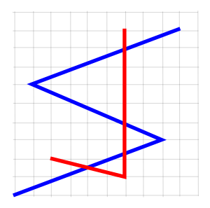

# idris-lineintersect

Takes two lines and returns all intersection points or ```false``` if there are none

## Install

```
$ npm install idris-lineintersect
```

## Usage

```
var il = require('idris-lineintersect')
```



### with coordinates

**.coordinates(** line1, line2, callback **)**

```
var line1 = [[0,0],[8,3],[1,6],[9,9]]
var line2 = [[2,2],[6,1],[6,9]]

il.coordinates(line1, line2, function(points) {
	// returns an array of points
	console.log(point)
})
```

Log looks like this

```
[ 
	[ 4, 1.5 ],
	[ 6, 2.25 ],
	[ 6, 3.857142857142857 ],
	[ 6, 7.875 ] 
]
```

### with features

**.features(** lineFeature1, lineFeature2, callback **)**

```
var lineFeat1 = {
	type: 'Feature', 
	geometry: {
		type: 'LineString', 
		coordinates: [[0,0],[8,3],[1,6],[9,9]] 
	}
}
var lineFeat2 = {
	type: 'Feature', 
	geometry: {
		type: 'LineString', 
		coordinates: [[2,2],[6,1],[6,9]] 
	}
}

il.features(lineFeat1, lineFeat2, function(points) {
	// returns an array of point features
	console.log(point)
})
```

Log looks like this

```
[ 
	{ type: 'Feature',
    properties: {},
    geometry: { type: 'Point', coordinates: [ 4, 1.5 ] },
	{ type: 'Feature',
    properties: {},
    geometry: { type: 'Point', coordinates: [ 6, 2.25 ] },
	{ type: 'Feature',
    properties: {},
    geometry: { type: 'Point', coordinates: [ 6, 3.857142857142857 ] },
	{ type: 'Feature',
    properties: {},
    geometry: { type: 'Point', coordinates: [ 6, 7.875 ] }
]
```

